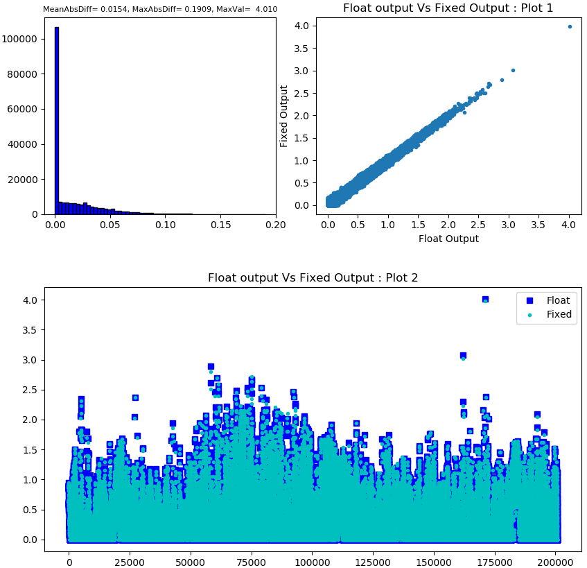
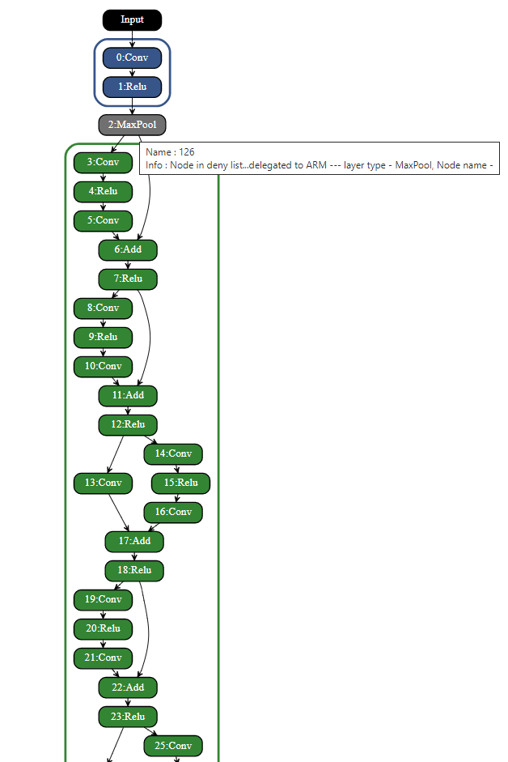
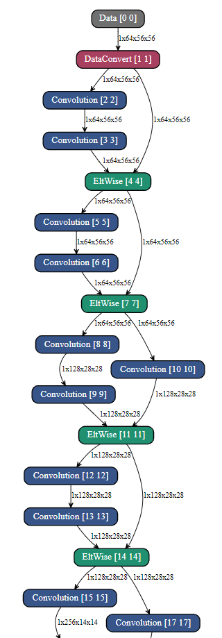

<!-- TOC -->

- [Troubleshooting Guide for both performance and accuracy/functional issues](#troubleshooting-guide-for-both-performance-and-accuracyfunctional-issues)
- [Troubleshooting for performance issues](#troubleshooting-for-performance-issues)
- [Model compilation issues](#model-compilation-issues)
- [Steps to Debug Error Scenarios for target(EVM/device) execution](#steps-to-debug-error-scenarios-for-targetevmdevice-execution)
- [Steps to Debug Functional Mismatch in Host emulation](#steps-to-debug-functional-mismatch-in-host-emulation)
- [Feature Map Comparison with Reference](#feature-map-comparison-with-reference)
  - [Script 1 : Layer level activation comparisons :](#script-1--layer-level-activation-comparisons-)
- [Trace dump utility for multi-core inference](#trace-stitching)
<!-- /TOC -->


# Troubleshooting Guide for both performance and accuracy/functional issues
This document lists troubleshooting steps for debugging accuracy and performance issues observed during model deployment. This section is common across the all the OSRT (TFlite / ONNX runtime /TVM-DLR )

# Troubleshooting for performance issues
- If user is observing performance issues during model deployment on C7x-DSP then user can refer this section to get more detailed performance information of any given model.
- User can set debug_level = 1 option during model inference to enable layer level performance. With this option, layer level  execution cycles for each layer will be displayed on console out as shown in below figure:

```
   Network Cycles 6294273

   Layer,   Layer Cycles,kernelOnlyCycles, coreLoopCycles,LayerSetupCycles,dmaPipeupCycles, dmaPipeDownCycles, PrefetchCycles,copyKerCoeffCycles
     1,          81811,          48850,          49277,           7779,          14969,                18,           1007,                16,
     2,          71051,          52722,          53246,           1473,           3290,                16,              0,                 0,
     3,          34063,          16700,          17307,           7379,           3952,                18,             17,                16,
     4,          60926,          45133,          45431,           6625,           4176,                18,            777,                 9,
     5,          29990,           5996,           6040,            871,           3432,                 9,              0,                 0,
     6,          30806,          14975,          15275,           6575,           4114,                61,             10,                 9,
     7,          20355,           5508,           5810,           6360,           3480,                11,             10,                 9,
     8,          34670,          20921,          21031,           6222,           2291,                18,            727,                 9,
```

- In the above figure "Network cycles" tells the total cycles consumed to execute a given network on C7x-MMA. This can be translated to time in ms by division of c7x frequency in M cycles. For example c7x-dsp running @ 1GHz time in ms can be calculated by dividing the "Network cycles" by 10^6.
- The logs in above figure gives detailed information about various profile points but from end user point of view, data  under column "Layer Cycles" shall be used to get layer cycles consumed by a particular layer. Rest all the columns are meant to be used by TI's internal team to debug performance issue.
- These traces are printed in the same order as layers gets executed on EVM, user can refer [here](#steps-to-debug-error-scenarios-for-targetevmdevice-execution) to find the mapping of layerId to dataId
- **Per layer execution traces are only applicable for target/EVM execution and are not applicable for host emulation mode of the inference execution**
# Model compilation issues
Following are some of the options for troubleshooting model compilation related issues.
* Before trying any option user should make sure that their inference script is functional with ARM only mode. For out of box examples user can enable ARM only mode ( i.e. without c7x offload) by passing “-d” as an argument to the default model compilation script 
As an example for ONNX out of box example script user can run in ARM only mode as below
    ```
    python3 onnxrt_ep.py -d
    ```
    For user's custom model they can refer [here](../examples/osrt_python/README.md#example-apis-for-tidl-offload-or-delegation-in-osrts) to enable ARM only mode
* User can set debug_level = 1 or 2 to enable verbose debug log during model compilation and during model inference
* If model inference works fine in ARM only mode but model compilation fails with C7x-MMA offload, then try dispatching some of the layers (less commonly used layer type) to ARM by using “deny_list” option.
* Additionally, it is recommended to disable default onnx graph optimizations (i.e. set session option for graph_optimization_level to onnxruntime.GraphOptimizationLevel.ORT_DISABLE_ALL)
   
# Steps to Debug Error Scenarios for target(EVM/device) execution 

- It is recommended to first test the inference of a given network in host/pc (x86_pc) emulation mode to make sure output is as per expectation.
- If execution on target(EVM) is not completing then user can enable more verbose logs by setting debug_level = 2, which is an optional parameter for both model compilation and inference. This option enables more detailed traces which will help in identifying the layer whose execution is not completing.
- If target (device/EVM) execution output for a given network is not matching the corresponding host/pc emulation output for the same, then user should follow the following steps to identify which layer causes the first mismatch:
  - Check if input to the network itself is mismatching then this indicates mismatch during pre-processing. Typically this can happen if pre-processing is involving floating point operations as floating point operation may differ slightly on x86 and on EVM, for example resize operation may not give bit exact output on EVM compared to x86. Final results shouldn't get impacted with this difference but layer level traces bit match cannot be done. In such scenario it is recommended to directly provide a raw binary input to the network and then compare rest of the layers.
  - Enable layer level fixed point traces in both host emulation and EVM execution. This can be done by setting debug_level = 3 parameter during inference. Layer level traces will be generated inside /tmp folder ( trace names will be like tidl_traceAAAA_BBBBB_CCCCC_DDDDDxEEEEE.y, AAAA is dataId, BBBBB is batch number, CCCCC is channel number, DDDDD is width and EEEEE is height). For example a trace name tidl_trace0072_00001_00256_00010x00014.y indicates the traces of layer with dataId = 72, batch = 1, channels = 256, height = 14 and width = 10. DataId is a unique number associated with each layer's output buffer to uniquely identify it. User can find the mapping of DataId to the layerId which is the order in which a particular layer is executed inside the artifacts directory under tempDir with file name ending with *.layer_info.txt. This file also contains the mapping of layerId/dataId to the name of the layer in original model. The first column in this file is the layerId and second is dataId and third is the name in original model.
  - Run the network on x86 using Host/PC emulation mode (on x86 PC this is already default behavior) with debug_level=3. All the traces will be generated in /tmp folder(if this folder is missing, please create the same). Copy all the layer level traces from /tmp to a folder lets call it traces_ref
  - Repeat the above step on target(EVM) execution. Copy the traces from /tmp folder to a folder, lets call it traces_target
  - Use any binary comparison tool (e.g. beyond compare, diff, cmp etc) to compare the traces_ref and traces_target folder
  - The outputs are expected to bit match and if any particular layer output is not matching in these two modes then the first layer where mismatch is observed is the layer which needs to be reported.

# Steps to Debug Functional Mismatch in Host emulation

- The following steps are suggested, when user finds functional issue or lower accuracy while running inference using TIDL with c7x offload to running the same model without c7x offload. All these steps needs to be performed in host emulation mode rather than on target(EVM) device for easier debugging. Once user achieves the acceptable accuracy with host emulation then host emulation and target execution on device can be bit-matched as described in [here](#steps-to-debug-error-scenarios-for-targetevmdevice-execution)
  - First step is to run the model in TIDL floating point mode and see if accuracy is same as what you get from Open Source Runtimes without c7x offload. To run the model with TIDL in floating point mode user will have to set tensor_bits = 32 during model compilation. (**Note that this flow is not optimized for our SOC's and is supported only in host emulation mode and it’s meant only for debug purpose**). 
  - If this accuracy matches then this indicates that model compilation was successful and without any quantization results are as per expectation.
  - Next step will be to check the accuracy with 8-bit quantization using default quantization options. If the accuracy is not as per expectation then this indicates that either 8-bit quantization is not enough or some layers are not behaving as per expectation with 8-bit quantization. We recommend to try 16-bit quantization for your network (Note that this option will results into more compute time for inference).
  - If 16 bit results are as per expectation then user can try mixed precision to manually/automatically increase the precision of activations/parameters of certain specific layers. The details of this option can be found in [here](./tidl_fsg_quantization.md##a31-manual-mixed-precision-), refer section on Mixed Precision. To choose which layers user will have to analyze the activation/parameters statistics. User can refer [here](#feature-map-comparison-with-reference) to view sample script given to generate such statistics or if required they can extend it to generate more statistics. User can also try automatic selection of mixed precision as described [here](./tidl_fsg_quantization.md#a32-automated-mixed-precision---automatic-selection-of-layers-), refer section on Automated Mixed Precision.


# Feature Map Comparison with Reference

- This section provides some steps to compare layer level feature maps generated from TIDL inference with the same being generated from OSRT without TIDL/c7x offload.
- Set debug_level = 4, this will result into generation of both fixed and floating point traces for each dataId. Note that data Id can be different from layer Id, there are two ways to find this mapping, first way is to read the mapping from the *layer_info.txt file (already described [here](#steps-to-debug-functional-mismatch-in-host-emulation)) . Second way is to read the output of model visualization tool (*.svg file, which also gets generated inside model artifacts folder under tempDir), this information can be read from each layer's box inside the square brackets as [layerIdx, dataIdx].
- Below figure shows a sample of both fixed point (*.y) and floating point (_float.bin) traces generated from TIDL :


- User can generate these traces for floating/16-bit and 8-bit by setting tensor_bits during model inference and compare them. Some sample scripts/functions are listed below for reference :

## Script 1 : Layer level activation comparisons :
- User can generate following plots to compare floating point output generated from OSRT without TIDL/c7x offload and with TIDL/c7x offload.
	- Plot 1 : Histogram of absolute difference. Plot with most of values closer to zero indicates the two tensors are similar
	- Plot 2 : TIDL fixed point inference output plotted against TIDL Floating inference output. Plot with most points around a 45 degree line indicates two tensors are similar
	- Plot 3 : TIDL Floating inference output and TIDL fixed point inference output plotted in the same plot. 
- Typically no single plot is enough to conclude the difference and each gives certain way to compare the two outputs.

- A sample plot is as shown as below :
  


- Following functions can be used to generate the above mentioned plots :

```
	import numpy as np
	import argparse
	import matplotlib
	import matplotlib.pyplot as plt
	import os
	import sys
	import subprocess
	import shutil

	def save_error_plot(float_output, fixed_output, axes):
		mx = np.max(float_data)
		mn = np.min(float_data)
		org_diff = (fixed_data - float_data)
		combined = np.vstack((float_data, fixed_data, org_diff)).T
		# #np.savetxt("figs\\"+str(i).zfill(4)+"_float.txt", combined, fmt='%10.6f, %10.6f, %10.6f')
		abs_diff = abs(fixed_data - float_data)
		maxIndex = np.argmax(abs_diff)
		max_abs_diff = np.max(abs_diff)
		mean_abs_diff = np.mean(abs_diff)
		var_abs_diff = np.var(abs_diff)

		axes.hist(abs_diff, color='blue', edgecolor='black', bins=60)
		# image_txt = "mean = " + str(mean) +", Var = "+ str(var) +", MAx = "+ str(mx)
		image_txt = "MeanAbsDiff=%7.4f, MaxAbsDiff=%7.4f, MaxVal=%7.3f" % (mean_abs_diff, max_abs_diff, mx)
		#plt.title(image_txt)
		axes.set_title(image_txt, fontdict = {'fontsize' : 8})


	def save_pc_ref_plot(float_output, fixed_output, axes):
		axes.set_title("Float output Vs Fixed Output : Plot 1")
		axes.set_xlabel('Float Output')
		axes.set_ylabel('Fixed Output')
		axes.plot(float_output, fixed_output, '.')

	def save_pc_ref_plot2(float_output, fixed_output, axes):
		axes.set_title("Float output Vs Fixed Output : Plot 2")
		axes.plot(float_output, "bs", label = "Float")
		axes.plot(fixed_output, "c.", label = "Fixed")
		axes.legend(loc='upper right', frameon=True)

```
**Note : These functions are given only for reference and may not work in all kind of environment**


# Trace dump utility for multi-core inference
*TIDL provides trace dump utility that dumps the binary output of each layer which can be used to compare and debug. When running for low latency mode with multiple cores, each core dumps its own trace with the prefix "C7X_{Core Number}_". 

*TIDL also provides an example script to stitch the traces for multiple cores which is equivalent to complete output for the layer. 

Stitched taces are generated in the /tmp/stitch_traces directory by default.

Parameters to the trace stitching script : 

|       Name      |                      Description                        |  Default    
|:-------------------|:--------------------------------------------------------|:--------------|
| t | trace directory path |  /tmp|
| n | number of cores |  4|
| s | start core Idx |  0|

More details on above parameters (which are also compilation options) can be found here [here](../examples/osrt_python/README.md#options-for-devices-with-multiple-dsp-cores)

To compare traces across different platfroms (e.g. PC vs target), direct one to one comparison is feasible. 
However, in cases where traces generated for inference mode = 2 (low latency mode across N cores) need to be compared with those gernerated for inference mode = 0 (single core inference), direct one-one mapping is not feasible due to some additional layers introduced as part of model compilation for multi-core inference.
Following additional parameters can be set in this case to get one-one mapping of layers in both the scenarios.


|       Name      |                      Description                        
|:-------------------------|:--------------------------------------------------------|
m_golden  |path to the single core layer_info.txt file (generated as part of the compilation artifacts in following path: model-artifacts/{model_name}/tempDir/***.layer_info.txt) |
m | path to multi core layer_info.txt file (path same as above) |

Note: File name being same, user needs to take back-up of **layer_info.txt file before running another inference instance.
The id of a layer in the stitched traces will be with respect to single core execution which may or may not be similiar to the id the layer has in low latency mode

## Steps to enable multi-core trace stitching using script: 
 * Compile the model for inference mode = 0 and infer the model with debug_level = 3 option to generate single core traces
 * Copy the single core traces and layer_info.txt file to another directory(needs to be created by the user) to create backup
 * Clean the trace directory to ensure no existing traces are present 
 * Compile the model for inference mode = 2 with desired number of cores and infer the model with debug_level = 3 option to generate multi-core traces
 * Run the python stitching script stitch_multicore_traces.py as follows (as an example, for 2 cores) :  

python3 scripts/tidl_debug_scripts/stitch_multicore_traces.py --n 2  --m model-artifacts/{model_name}/tempDir/**.layer_info.txt --m_golden model-artifacts/{model_name}/tempDir_singlecore/**.layer_info_singleCore.txt 

*in the above example the layer_info.txt has been moved to tempDir_singlecore to create backup*


# Graph Visualization

## Introduction
TIDL provides Graph Visualization Utility (hereafter called as graphviz) for representing the imported network as a graph.

## Types of graph visualization
TIDL provides following 2 types of graph visualization:
### Runtimes graphviz : 
  * The purpose of runtimes graphviz is to depict which layers part of the original model are accelerated on TI DSP and which layers are delegated to native runtimes (ARM core on device). 
  * All the nodes belonging to a subgraph delegated to DSP are enclosed by a bounding box. All the nodes are colored with the same color as the box, and different subgraphs are identified by different colors. Nodes delegated to ARM are depicted in grey color. 
  * User can hover over the nodes to get more information about the nodes e.g. why ARM delegated nodes are not supported on DSP, any tips for performance enhancement, etc.
  * This graphViz is available at following location in user specified 'artifacts_folder' in compilation options : artifacts_folder/tempDir/runtimes_visualization.svg

#### Example visualization
Following image shows runtimes graphviz generated for the demo model resnet18v1 available as part of examples/osrt_python3/onnxrt_ep.py by specifying 'deny_list:layer_type':'MaxPool' in compilation options to demonstrate multiple subgraph case.  

MaxPool breaks network in 2 subgraphs delegated to DSP : Subgraph 1 colored Blue and subgraph 2 colored Green, with MaxPool delegated to ARM.



### Compiled artifacts graphviz:
  * Each of the subgraphs enclosed by bounding box in runtimes graphviz is converted to TIDL artifacts as part of model compilation
  * Compiled artifacts graphViz allows the user to visually analyze the TIDL compiled subgraphs along with various layer parameters like kernel dimensions, stride, padding, etc. It contains some of the private information for different TIDL layers which can be useful for debug.
  * It uses different background colors in order to distinguish among different layers - each layer type is identified by a unique color (note : these colors are not related to colors in runtimes graphviz)
  * User can get details about each layer by hovering the mouse pointer over the individual layer's box. Each layer's box contains two identifiers: [layerIdx, dataIdx], where layerIdx indicates the order in which a particular layer is executed and dataIdx is a unique number associated with each layer's output buffer to uniquely identify it.
  * Note that layer level traces generated by setting debug_level = 3 as part of compilation options are always in terms of dataIdx. User can use this information to report any issue
  * This graphviz is available at following location in user specified 'artifacts_folder' in compilation options : artifacts_folder/tempDir/{subgraphId}_tidl_net.bin.svg, where subgraphId corresponds to the tensor index/output names of the subgraph output nodes.

#### Example visualization

Following image shows compiled artifacts graphviz generated for the same model demonstrated for [runtimes visualization](#example-visualization).  

Subgraph 1 (125_tidl_net.bin.svg - Blue subgraph in runtimes_visualization) - '125' is the output name of first subgraph:

 

Partial snapshot of subgraph 2 (191_tidl_net.bin.svg - Green subgraph in runtimes_visualization) - '191' is the output name of second subgraph:

